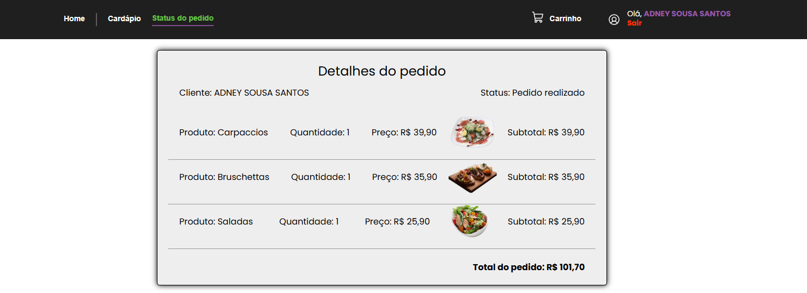
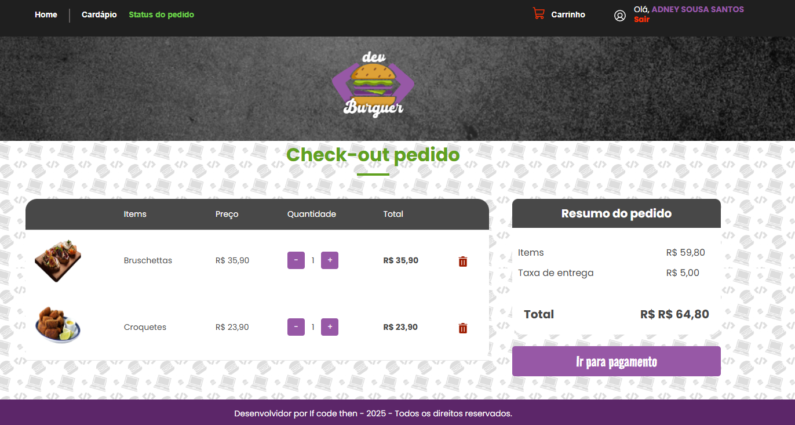
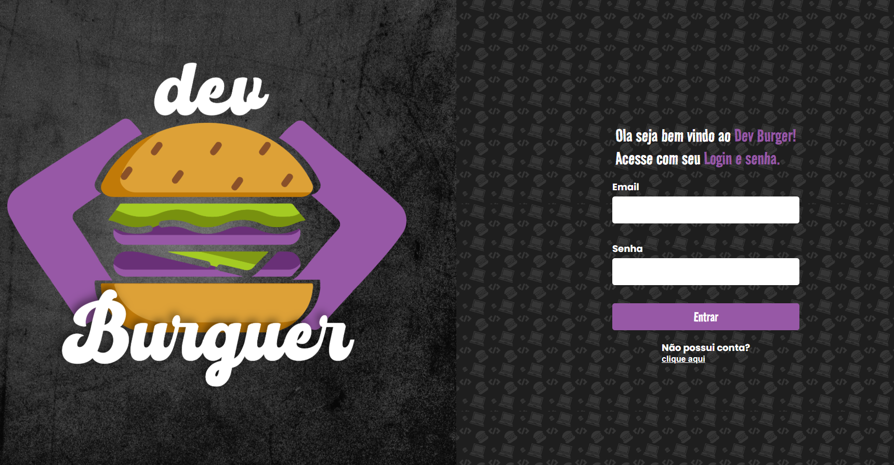
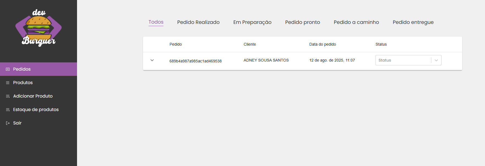

# 🍔 Dev Burger - Frontend

Frontend do sistema **Dev Burger**, uma aplicação web para gestão e venda de pedidos de fast food.  
O sistema conta com **área administrativa**, integração de pagamentos via **Stripe** e uma experiência de compra moderna e responsiva.

---

## 🚀 Funcionalidades

- 📜 **Apresentação de cardápio** com produtos organizados e destaque para promoções
- 💳 **Integração de vendas com Stripe** para pagamentos online
- 🛒 **Adição e remoção de produtos** do carrinho com feedback visual via **React Toastify**
- 📢 **Alertas e notificações** interativos
- 🖥 **Área administrativa** para:
  - Compartilhar status de pedidos com clientes
  - Editar produtos existentes
  - Adicionar novos produtos ao cardápio
- 📱 **Design responsivo** para todos os dispositivos
- 🎨 **Estilização com Styled-components**

---

## 📸 Screenshots
<div align="center">
  
  
  
  
</div>
---

## 🛠 Tecnologias Utilizadas!


- **[React](https://react.dev/) + [Vite](https://vitejs.dev/)**
- **[Styled-components](https://styled-components.com/)**
- **[React Toastify](https://fkhadra.github.io/react-toastify/)**
- **[Stripe API](https://stripe.com/docs/api)** (integração de pagamentos)

---

## 📦 Instalação e Uso

```bash
# Clone o repositório
git clone https://github.com/AdneySousah/dev-burger.git

# Acesse a pasta do projeto
cd dev-burger

# Instale as dependências
npm install

# Crie o arquivo .env e configure suas variáveis (exemplo no .env.example)

# Execute o projeto em modo desenvolvimento
npm run dev

# O projeto estará disponível em:
# http://localhost:5173/
